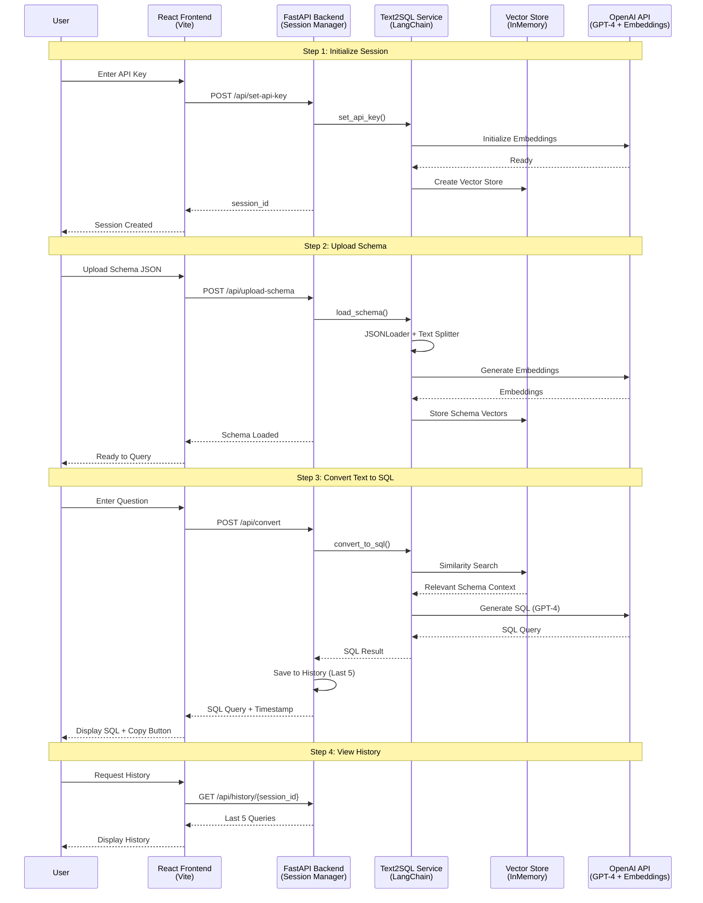

# Text2SQL - Natural Language to SQL Query Converter

Transform your natural language questions into perfect SQL queries using AI! This application leverages OpenAI's GPT-4 and LangChain to intelligently convert plain English into accurate SQL queries based on your database schema.

## 🌟 Features

- **Natural Language Processing**: Ask questions in plain English and get SQL queries
- **Schema-Aware**: Upload your database schema for context-aware query generation
- **Query History**: Track your last 5 queries for easy reference
- **Session Management**: Secure session-based API key and schema handling
- **Modern UI**: Beautiful, responsive React interface with real-time results
- **Vector-Based Retrieval**: Uses semantic search to find relevant schema context
- **Copy to Clipboard**: Easily copy generated SQL queries

## 🏗️ Architecture



### System Components

1. **Frontend (React + Vite)**
   - API Key Input Component
   - Schema Upload Component
   - Query Input Component
   - Query Result Display
   - Query History (Last 5 queries)

2. **Backend (FastAPI)**
   - RESTful API endpoints
   - Session management
   - CORS middleware for cross-origin requests
   - File upload handling

3. **Text2SQL Service (LangChain)**
   - Schema loading with JSONLoader
   - Document splitting with RecursiveCharacterTextSplitter
   - Vector storage with InMemoryVectorStore
   - Context retrieval using similarity search
   - SQL generation using OpenAI GPT-4.1-nano

4. **External Services**
   - OpenAI GPT-4.1-nano for SQL query generation
   - OpenAI text-embedding-3-large for schema embeddings

## 🚀 Quick Start

### Prerequisites

- Python 3.8 or higher
- Node.js 16 or higher
- OpenAI API key ([Get one here](https://platform.openai.com/api-keys))

### Installation

1. **Clone the repository**
   ```bash
   git clone <repository-url>
   cd text2sql
   ```

2. **Backend Setup**
   ```bash
   cd backend
   pip install -r requirements.txt
   uvicorn app:app --reload --port 8000
   ```

3. **Frontend Setup** (in a new terminal)
   ```bash
   cd frontend
   npm install
   npm run dev
   ```

4. **Access the application**
   - Frontend: http://localhost:5173
   - Backend API: http://localhost:8000
   - API Docs: http://localhost:8000/docs

## 📖 Usage

### Step 1: Set Your API Key
Enter your OpenAI API key in the first card. This will create a session for you.

### Step 2: Upload Database Schema
Upload your database schema as a JSON file. See the example format below or check `Data/db_schema.json`.

### Step 3: Ask Questions
Type your question in natural language, such as:
- "Show me all movies released in 2020"
- "Find the top 10 highest-rated TV series"
- "List all actors who worked with Christopher Nolan"

### Step 4: Get SQL Query
The application will generate the corresponding SQL query, which you can copy and use directly.

### Step 5: View History
Check your query history to review previous conversions.

## 📋 Database Schema Format

Your schema JSON should be an array of table objects:

```json
[
  {
    "table_name": "users",
    "description": "User account information",
    "columns": [
      {
        "name": "id",
        "type": "integer",
        "description": "Unique user identifier"
      },
      {
        "name": "username",
        "type": "string",
        "description": "User's login name"
      },
      {
        "name": "email",
        "type": "string",
        "description": "User's email address"
      }
    ],
    "primary_key": "id",
    "foreign_keys": []
  }
]
```

## 🔌 API Endpoints

| Endpoint | Method | Description |
|----------|--------|-------------|
| `/` | GET | Health check |
| `/api/set-api-key` | POST | Set OpenAI API key and create session |
| `/api/upload-schema` | POST | Upload database schema JSON file |
| `/api/convert` | POST | Convert natural language to SQL |
| `/api/history/{session_id}` | GET | Retrieve query history |

## 🛠️ Technology Stack

### Backend
- **FastAPI**: Modern, fast web framework for building APIs
- **LangChain**: Framework for developing LLM-powered applications
- **OpenAI**: GPT-4.1-nano for query generation, text-embedding-3-large for embeddings
- **Pydantic**: Data validation using Python type annotations
- **Uvicorn**: ASGI server for running FastAPI

### Frontend
- **React**: UI library for building interactive interfaces
- **Vite**: Next-generation frontend build tool
- **Modern CSS**: Custom styling with CSS variables and animations

## 🔒 Security Notes

- API keys are stored in memory only (session-based)
- No persistent storage of sensitive data
- CORS configured for local development
- Sessions are isolated per user

## 🐛 Troubleshooting

### PowerShell Execution Policy Error
```powershell
Set-ExecutionPolicy -ExecutionPolicy RemoteSigned -Scope CurrentUser
```

### Port Already in Use
- Backend: Change port in `backend/app.py` (line 191)
- Frontend: Change port in `frontend/vite.config.js`

### CORS Issues
Ensure both servers are running and the frontend is configured to proxy to `http://localhost:8000`

## 📝 Example Use Case

This project includes an example IMDb database schema (`Data/db_schema.json`) with tables for:
- Movies and TV shows
- Cast and crew information
- Ratings and reviews
- Episode details
- Alternate titles

Try questions like:
- "Find all movies directed by Steven Spielberg"
- "Show the highest-rated episodes of Breaking Bad"
- "List actors born after 1990"

## 🤝 Contributing

Feedback and contributions are welcome! Please reach out at chashokus@gmail.com

## 📄 License

This project is open source and available for educational and commercial use.

## 🙏 Acknowledgments

- Powered by OpenAI GPT-4 and LangChain
- Built with FastAPI and React
- Inspired by the need to make SQL accessible to everyone

---

**Made with ❤️ for developers who want to query databases naturally**